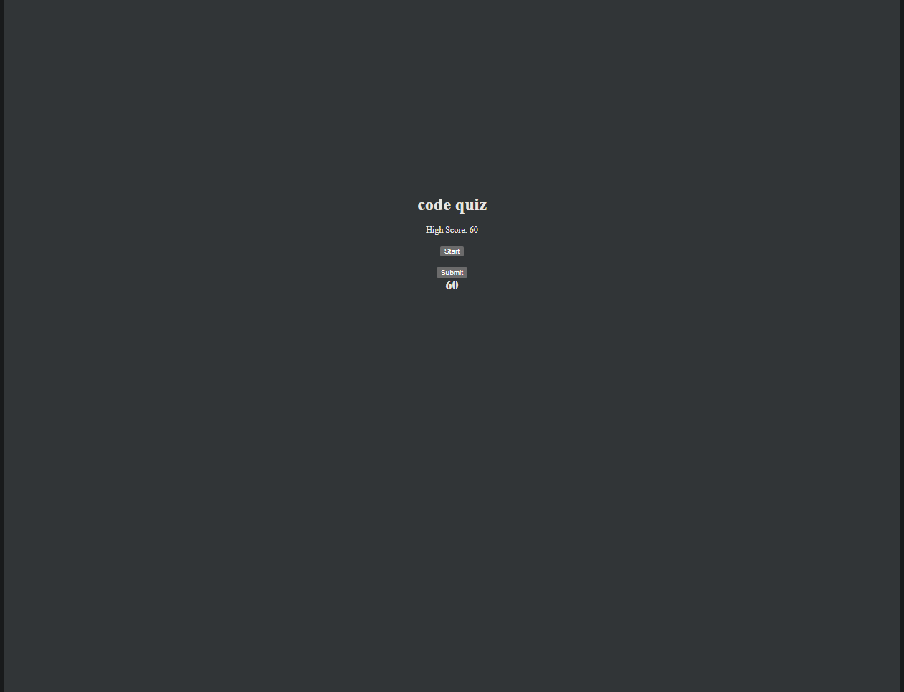

# Quiz

This is a simple quiz application built using HTML, CSS, and JavaScript.
## Usage
Link to quiz - https://ccovin1.github.io/code-quiz/
 
## How to Use

1. Open the `index.html` file in your web browser.
2. Click on the "Start" button to begin the quiz.
3. Answer the questions by selecting one of the provided options.
4. If your answer is correct, you will proceed to the next question. Otherwise, 10 seconds will be deducted from the timer.
5. Once the quiz is completed or the timer reaches 0, you can enter your initials and click the "Submit" button to save your score.
6. The high score will be displayed at the top of the page.

## Customization

- To modify the quiz questions, open the `script.js` file and update the `quizQuestions` array with your own questions, options, and answers.
- You can customize the styling of the quiz by modifying the `style.css` file.

## Features

- Multiple-choice questions
- Timer countdown
- Saving and displaying the high score using local storage

## Compatibility

This quiz application has been tested and confirmed to work on modern web browsers.

## License

This project is licensed under the [MIT License](LICENSE).
